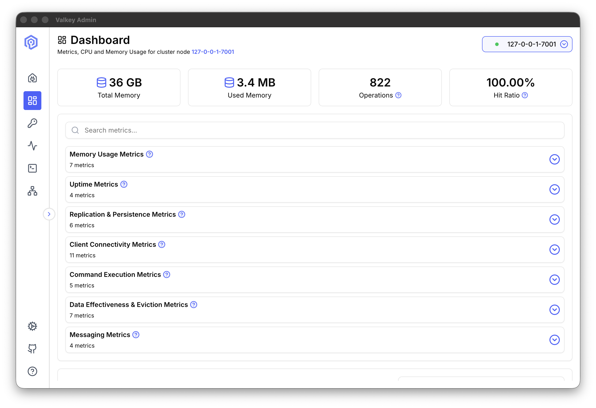
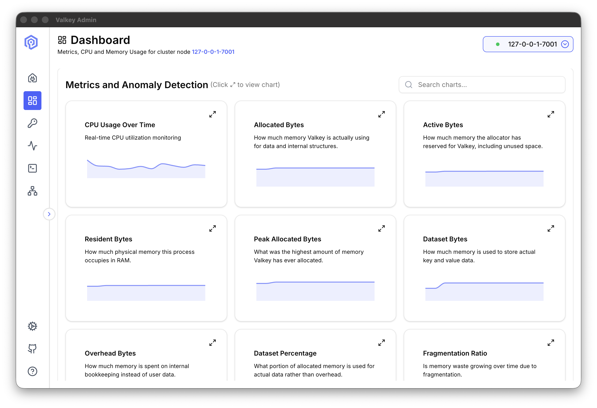
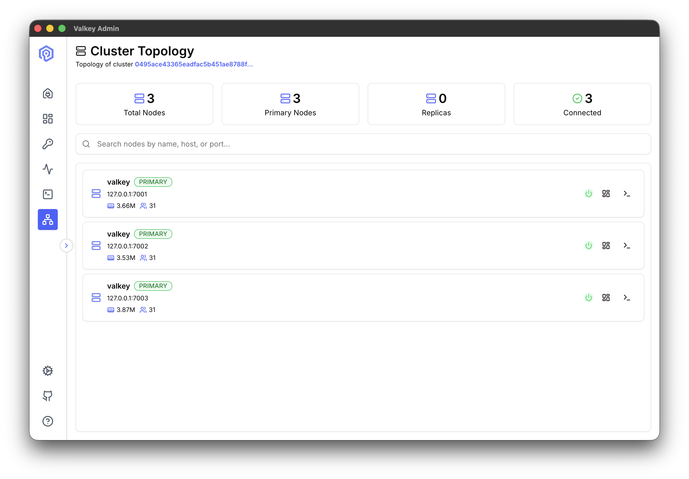
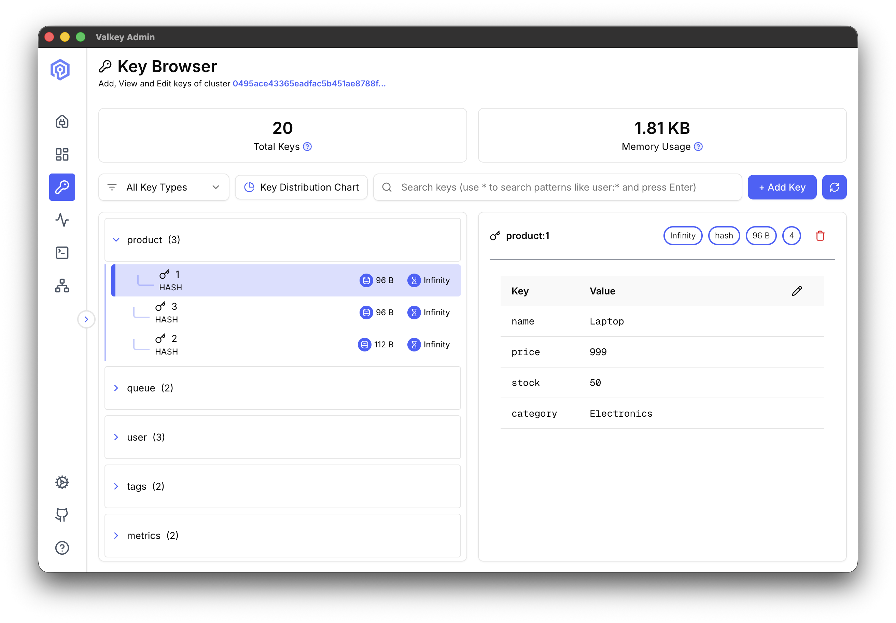
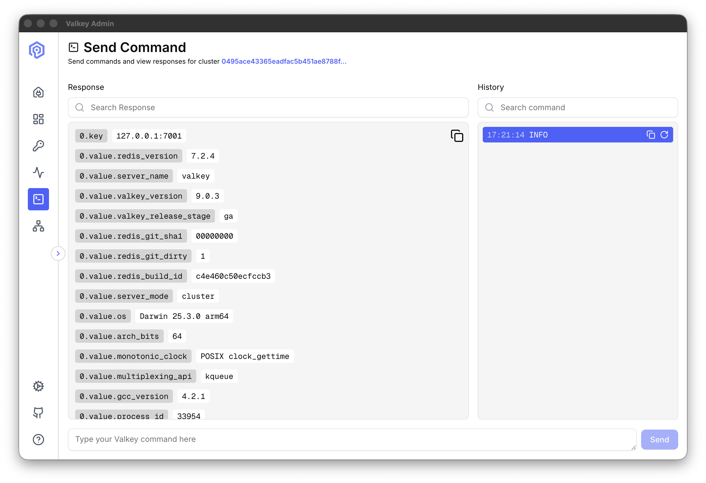
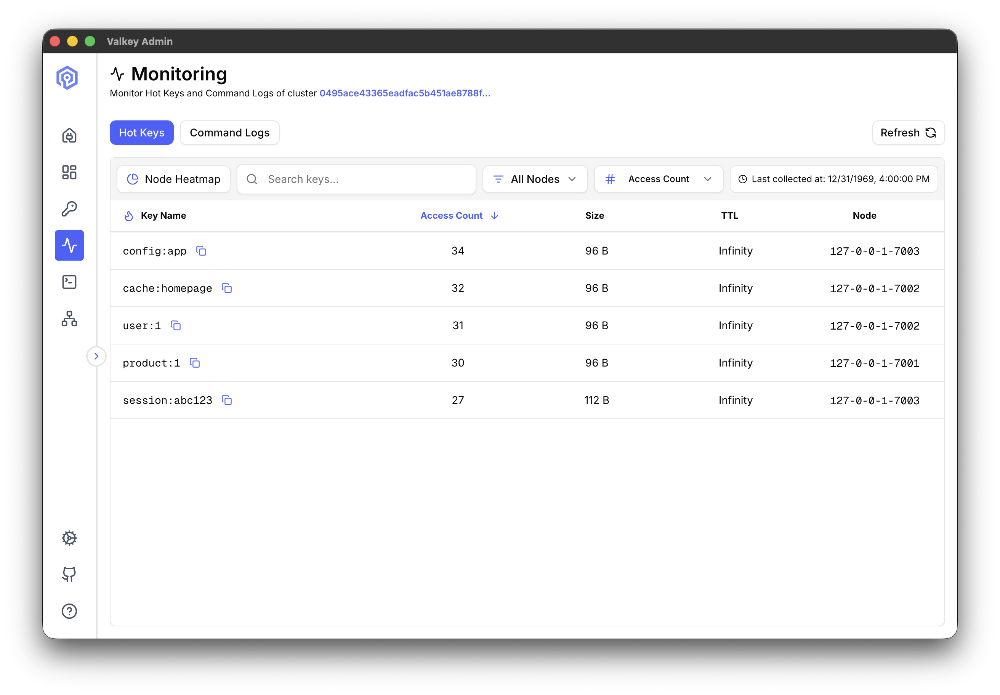
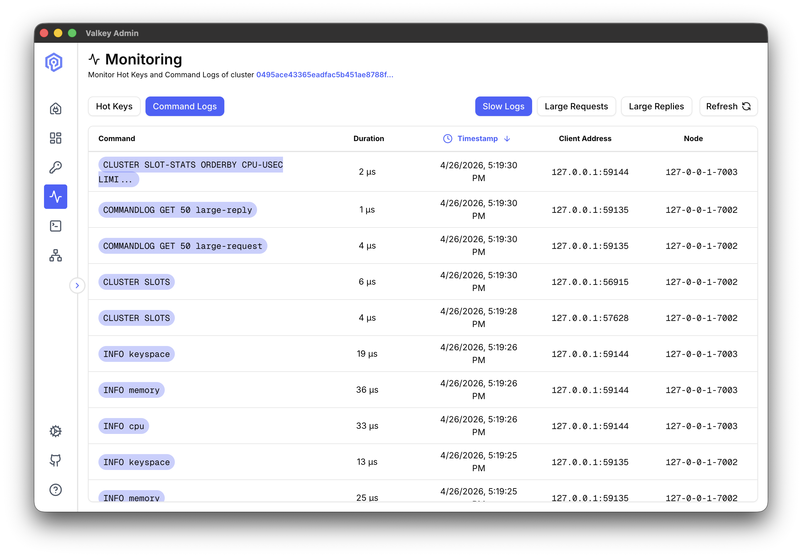
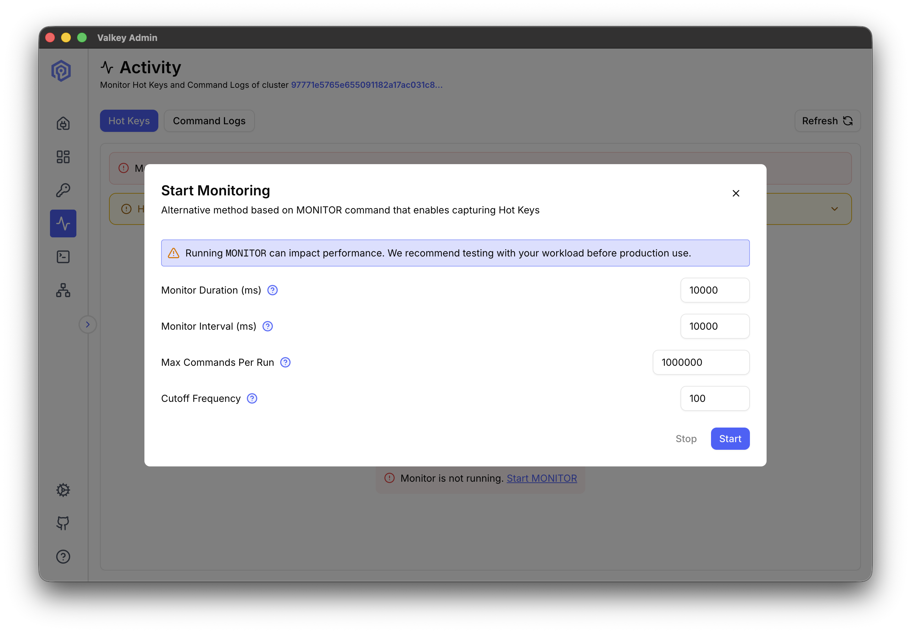

# Valkey Admin

Valkey Admin is a web-based administration tool for [Valkey](https://valkey.io) clusters and standalone instances. It provides an intuitive interface to monitor, manage, and interact with your Valkey deployments.

> **Compatibility:** Valkey Admin works with all versions of Valkey. Some features require newer versions:
> - **Command Logs** (slow commands, large requests/replies): Valkey 8.1+
> - **Hot Slots Detection** (via `CLUSTER SLOT-STATS`): Valkey 8.0+ with `cluster-slot-stats-enabled` set to `yes`

## Features

- **Dashboard:** real-time metrics including memory usage, CPU, connected clients, hit ratio, and command throughput




- **Cluster Topology:** visual map of shards, primaries, and replicas with per-node metrics



- **Key Browser:** browse, search, inspect, and edit keys across all data types (String, Hash, List, Set, Sorted Set, Stream, JSON)



- **Send Command:** execute Valkey commands with response formatting and command history



- **Hot Keys Monitoring:** identify frequently accessed keys across all cluster nodes



- **Command Logs:** view slow commands, large requests, and large replies aggregated across the cluster



## Platform Support

- **macOS** (native desktop app)
- **Linux** (native desktop app — AppImage and deb)
- **Docker** (web deployment)
- **Kubernetes** (web deployment with metrics sidecars)

## Installation

### Desktop App

Download the latest release from [GitHub Releases](https://github.com/valkey-io/valkey-admin/releases):

- **macOS:** Download the `.dmg` file, open it, and drag Valkey Admin to Applications
- **Linux:** Download the `.AppImage` or `.deb` package

### Docker

Docker images are published to the following registries:

| Registry | Image |
|----------|-------|
| GitHub Container Registry | `ghcr.io/valkey-io/valkey-admin` |
| Docker Hub | `valkey/valkey-admin` |
| Amazon ECR Public Gallery | `public.ecr.aws/valkey/valkey-admin` |

**Example:** 
```bash
docker pull valkey/valkey-admin:latest
```

See [examples/](./examples/) for deployment guides including Docker, Kubernetes, and AWS ElastiCache.


## Resource Sizing

In Web and Docker deployment modes, Valkey Admin spawns a metrics server process for each primary node in the cluster. Plan resources accordingly.

**Formulas:**
- **RAM:** `(primary nodes × 150 MB) + 1 GB`
- **Disk:** `(primary nodes × 50 MB) + 1 GB`

### Approximate Resource Recommendations

| Cluster Size | Recommended Spec |
|---|---|
| 1–5 primaries | 2 vCPU, 2 GB RAM |
| 5–50 primaries | 2 vCPU, 8 GB RAM |
| 50–100 primaries | 4 vCPU, 16 GB RAM |
| 100–200 primaries | 4 vCPU, 32 GB RAM |
| 200–400+ primaries | 8 vCPU, 64 GB RAM |

> **Warning:** These recommendations are based on the default retention settings in [config.yml](./apps/metrics/config.yml). If you increase `data_retention_mb` or `data_retention_days`, adjust your resource allocation accordingly. Disk usage scales at approximately `(primary nodes × 50 MB) + 1 GB` with default retention settings.

For Kubernetes deployments, metrics servers run as sidecars on each Valkey pod, so the main Valkey Admin deployment only needs ~1 GB RAM.

> **Note:** The desktop app (Electron) spawns a metrics server for each node you connect to. For large clusters, connecting to many nodes individually will increase local RAM and disk usage. Refer to the [formulas above](#resource-sizing) to ensure your machine can handle the load.

## Configuration

Valkey Admin is configured through environment variables. All variables are optional. 

### Backend Server

| Variable | Description | Default |
|----------|-------------|---------|
| `PORT` | Server listen port | `8080` |
| `DEPLOYMENT_MODE` | Controls metrics server orchestration. If `Web`, all metrics servers for cluster nodes start on any successful connection. If `Electron`, the metrics server only starts when you've successfully connected to a particular node. | `Electron` for Desktop and `Web` for Docker |
| `TTL` | Metrics server health check timeout (ms) | `60000` |
| `TOPOLOGY_REFRESH_INTERVAL` | Cluster topology refresh interval (ms) | `30000` |
| `HOT_KEYS_COUNT` | Maximum number of hot keys returned per query | `50` |
| `COMMAND_LOGS_COUNT` | Maximum number of command log entries returned per query | `100` |

### Pre-configured Metrics Collection

Set these to start all metrics servers for your cluster on startup, before manually connecting via UI (Web and K8 modes):

| Variable | Description | Default |
|----------|-------------|---------|
| `VALKEY_HOST` | Valkey host or cluster endpoint | — |
| `VALKEY_PORT` | Valkey port | `6379` |
| `VALKEY_TLS` | Enable TLS | `false` |
| `VALKEY_VERIFY_CERT` | Verify TLS certificate | `false` |
| `VALKEY_ENDPOINT_TYPE` | `node` or `cluster-endpoint` | `cluster-endpoint` |
| `VALKEY_AUTH_TYPE` | `password` or `iam` | `password` |
| `VALKEY_USERNAME` | Authentication username | — |
| `VALKEY_PASSWORD` | Authentication password | — |
| `VALKEY_AWS_REGION` | AWS region (IAM auth only) | — |
| `VALKEY_REPLICATION_GROUP_ID` | ElastiCache replication group ID (IAM auth only) | — |

### Metrics Server

These are set automatically when the server spawns metrics processes. 

| Variable | Description | Default |
|----------|-------------|---------|
| `CONFIG_PATH` | Path to metrics config YAML. Mount a custom file to override collection and retention settings. | `config.yml` |
| `DATA_DIR` | Metrics data storage directory | `./data` |
| `SERVER_HOST` | Main server host for registration. Default is localhost, as metrics servers are forked from the main process. | `localhost` |
| `SERVER_PORT` | Main server port for registration | `8080` |

### Metrics Config (`config.yml`)

The metrics config file controls collection intervals and data retention. Override it by mounting a custom file and setting `CONFIG_PATH`.

See [apps/metrics/config.yml](./apps/metrics/config.yml) for the default epic configuration.

**Global settings:**

| Setting | Description | Default |
|---------|-------------|---------|
| `backend.ping_interval` | How often each metrics server pings the main server (ms) | `10000` |
| `collector.batch_ms` | Batch write interval for metric data (ms) | `60000` |
| `collector.batch_max` | Max records per batch write | `500` |

**Per-epic settings:**

Each metric collector (epic) supports the following options:

| Setting | Description | Default |
|---------|-------------|---------|
| `poll_ms` | Collection interval (ms) | varies by epic |
| `data_retention_mb` | Max disk space per epic (MB). Oldest files evicted when exceeded. | `10` |
| `data_retention_days` | Files older than this are deleted during daily cleanup. | `30` |

## Hot Keys Detection

Valkey Admin supports two methods for detecting hot keys across your cluster:

### Hot Slots (Recommended)

Uses the `CLUSTER SLOT-STATS` command to identify hot slots by CPU usage, network ingress, and network egress. This is the preferred method as it has no performance impact on your cluster.

**Requirements:**
- Valkey 8.0+ (the `CLUSTER SLOT-STATS` command was introduced in Valkey 8.0)
- `cluster-slot-stats-enabled` set to `yes`
- LFU eviction policy (`allkeys-lfu` or `volatile-lfu`) configured on the cluster
- Cluster mode (not available for standalone instances)

When both conditions are met, Valkey Admin queries each shard's slot statistics and identifies the hottest slots by `cpu-usec`. It then resolves the keys within those slots to surface the hottest keys in those slots.

> **Note:** The access count shown for hot slots keys is the LFU logarithmic frequency (0–255), not a raw access count. A key accessed millions of times may show a frequency of ~70. 

### Monitor-based Detection

Uses the Valkey `MONITOR` command to capture all commands in real time, then aggregates key access frequency from the command stream. Works with any Valkey or Redis version, in both standalone and cluster modes.

**How it works:**

When you start monitoring, two settings control the sampling behavior:

- **Duration:** How long each sampling run captures commands (default: 10 seconds). During this window, the `MONITOR` command streams every command executed on the server, and the metrics server counts key access frequency.
- **Interval:** How long to wait between sampling runs (default: 10 seconds). After each duration completes, the metrics server pauses for the interval before starting the next run.
- **Max Commands Per Run:** Maximum number of commands captured during each monitoring cycle (default: 1,000,000). If the limit is reached before the duration expires, the cycle ends early. Lower values reduce memory usage on busy clusters.
- **Cutoff Frequency:** Minimum number of times a key must be accessed during a monitoring cycle to be considered hot (default: 100). Keys accessed fewer times are filtered out. Lower values show more keys; higher values surface only the most active keys.

This creates a repeating cycle: capture for *duration*, pause for *interval*, capture again. The hot keys displayed are from the most recent sampling run.



**Cluster behavior:**

- **Web/Docker mode:** Monitoring starts on all primary nodes in the cluster simultaneously, regardless of which node you connected to. The reconcile loop ensures every primary has a metrics server, and the monitor command is sent to all of them.
- **Desktop (Electron) mode:** Monitoring only starts on nodes you have explicitly connected to. If you connected to one node in a 20-shard cluster, only that node is monitored. Connect to additional nodes individually to monitor them.

In both modes, hot keys are aggregated across all monitored nodes and sorted by access count.

**Trade-offs:**
- `MONITOR` has a performance impact on the server — it streams every command to the monitoring client
- Best suited for short diagnostic sessions, not continuous monitoring

When hot slots requirements are not met, Valkey Admin prompts you to start monitoring to calculate hot keys.

## Notes
- **No built-in authentication** — relies on external auth (Cognito, reverse proxy) for web deployments
- **Metrics servers are per-primary only** — no independent monitoring of replica nodes
- **No RBAC within the app** — any connected user can run any command the Valkey ACL allows
- **Key browser sample size:** The key browser scans up to approximately 1,000 keys across the cluster. Keys beyond this limit are not displayed but can still be found using the search function, which performs a targeted lookup.


## Contributing

Interested in improving Valkey Admin? See [CONTRIBUTING.md](./CONTRIBUTING.md) for development setup, architecture guidelines, and the contribution process.

## License

Valkey Admin is released under the [Apache License 2.0](./LICENSE).
