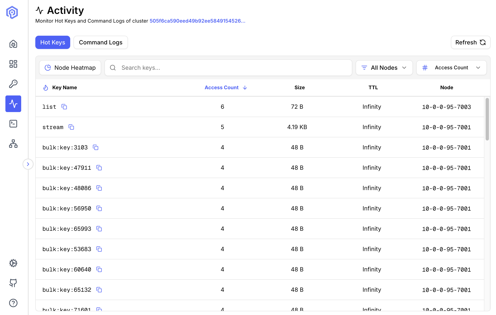
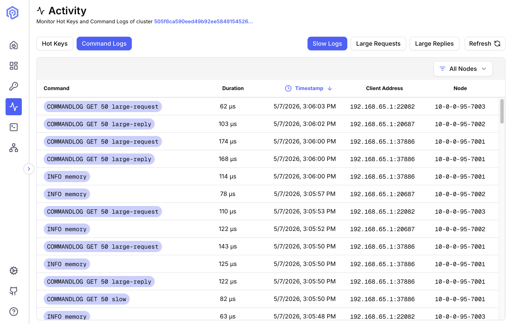
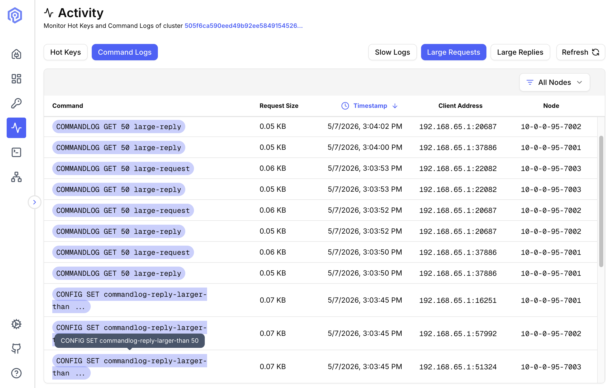
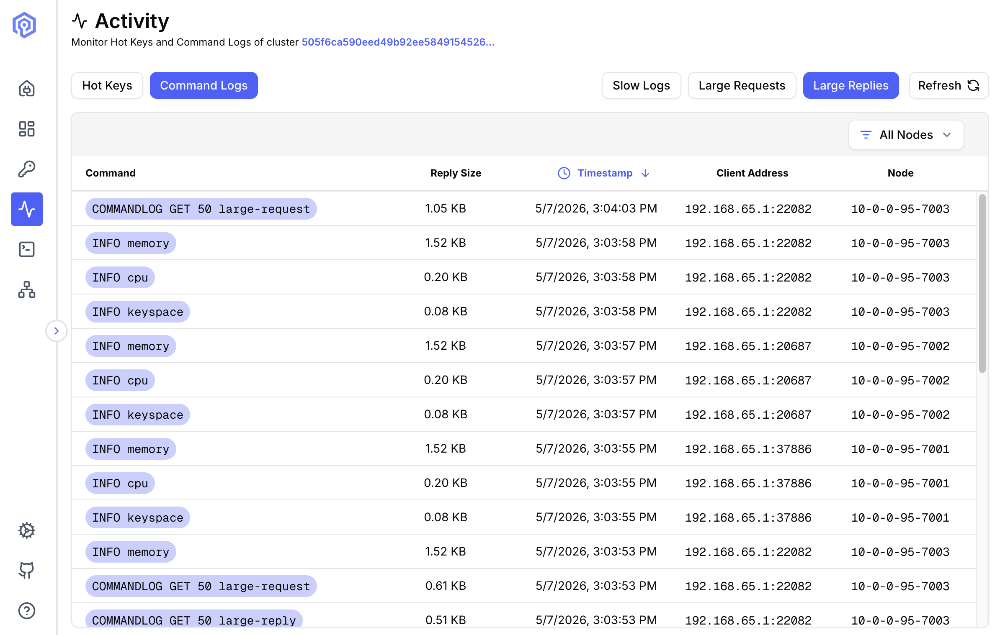

The Activity view provides real-time visibility into hot keys and [command logs](https://valkey.io/commands/commandlog-get/) across your cluster. It has two tabs: **Hot Keys** and **Command Logs**.

## Hot Keys Monitoring

Track the most frequently accessed keys in your cluster.



### What are Hot Keys?

Hot keys are keys that receive disproportionately high traffic, potentially causing:
- Performance bottlenecks
- Uneven load distribution
- Memory pressure on specific nodes

Valkey Admin supports two detection methods: **Hot Slots** (recommended) and **Monitor-based detection**.

### Hot Slots Detection (Recommended)

Uses the `CLUSTER SLOT-STATS` command to identify hot slots by CPU usage, network ingress, and network egress. This is the preferred method as it has **no performance impact** on your cluster.

**Requirements:**
- Valkey 8.0+ (`CLUSTER SLOT-STATS` was introduced in Valkey 8.0)
- `cluster-slot-stats-enabled` set to `yes`
- LFU eviction policy (`allkeys-lfu` or `volatile-lfu`) configured on the cluster
- Cluster mode (not available for standalone instances)

When all conditions are met, Valkey Admin queries each shard's slot statistics, identifies the hottest slots by `cpu-usec`, and resolves the keys within those slots.

:::note
The access count shown for hot slots keys is the LFU logarithmic frequency (0–255), not a raw access count. A key accessed millions of times may show a frequency of ~70.
:::

### Monitor-based Detection

Uses the Valkey `MONITOR` command to capture all commands in real time, then aggregates key access frequency from the command stream. Works with any Valkey or Redis version, in both standalone and cluster modes.

When you start monitoring, four settings control the sampling behavior:

- **Duration:** How long each sampling run captures commands (default: 10 seconds).
- **Interval:** How long to wait between sampling runs (default: 10 seconds).
- **Max Commands Per Run:** Maximum commands captured per cycle (default: 1,000,000). Lower values reduce memory usage on busy clusters.
- **Cutoff Frequency:** Minimum access count for a key to be considered hot (default: 100). Lower values show more keys; higher values surface only the most active keys.

This creates a repeating cycle: capture for *duration*, pause for *interval*, capture again. The hot keys displayed are from the most recent sampling run.

**Cluster behavior:**
- **Web/Docker mode:** Monitoring starts on all primary nodes simultaneously.
- **Desktop (Electron) mode:** Monitoring only starts on nodes you have explicitly connected to.

In both modes, hot keys are aggregated across all monitored nodes and sorted by access count.

:::caution
`MONITOR` has a performance impact on the server — it streams every command to the monitoring client. Best suited for short diagnostic sessions, not continuous monitoring.
:::

When hot slots requirements are not met, Valkey Admin prompts you to start monitoring to calculate hot keys.


## Slow Logs

Monitor commands that take longer than expected to execute.



### What are Slow Logs?

Slow logs record commands exceeding a configured execution time threshold, helping identify:
- Inefficient commands
- Large data operations
- Potential optimization targets

### Configuration

Set slow log threshold:

```bash
# Log commands taking longer than 10ms
CONFIG SET slowlog-log-slower-than 10000
```

### Viewing Slow Logs

Each entry shows:

- **Timestamp**: When command was executed
- **Duration**: Execution time (microseconds)
- **Command**: Full command text
- **Arguments**: Command arguments (abbreviated if large)
- **Client Address**: Source of the command

### Analysis

Use slow logs to:
- **Identify Bottlenecks**: Find consistently slow operations
- **Optimize Queries**: Refactor inefficient commands
- **Capacity Planning**: Understand load patterns
- **Debug Issues**: Track down performance problems

### Common Slow Commands

- `KEYS *`: Scans entire keyspace (use SCAN instead)
- Large `HGETALL`: Fetching huge hashes
- `SORT`: Without LIMIT on large sets
- `SMEMBERS`: On large sets

## Large Requests

Track commands with large input payloads.



### Why Monitor Large Requests?

Large requests can:
- Saturate network bandwidth
- Increase memory usage
- Block other operations
- Slow down replication

### Metrics Tracked

- **Request Size**: Payload size in bytes
- **Command**: Operation type
- **Key**: Target key
- **Timestamp**: When received
- **Client**: Source address

### Setting Thresholds

Configure what constitutes a "large" request:

```bash
# Alert on requests larger than 1MB
CONFIG SET commandlog-request-larger-than 1000
```

## Large Replies

Monitor commands returning large response payloads.



### What are Large Replies?

Large replies are responses exceeding a size threshold, indicating:
- Oversized data structures
- Inefficient queries
- Potential network saturation

### Common Causes

- `HGETALL` on huge hashes
- `LRANGE` retrieving entire lists
- `SMEMBERS` on large sets
- `ZRANGE` without limits

### Metrics

- **Reply Size**: Response payload size
- **Command**: Query that generated response
- **Duration**: Time to generate and send
- **Node**: Source node
- **Client**: Destination address

### Setting Thresholds

Configure what constitutes a "large" request:

```bash
# Alert on requests larger than 1MB
CONFIG SET commandlog-reply-larger-than 1000
```

## Next Steps

- Optimize queries found in the [Send Command](/features/send-command/)
- Analyze key distribution in [Key Browser](/features/key-browser/)
- Review cluster health on the [Dashboard](/features/dashboard/)
