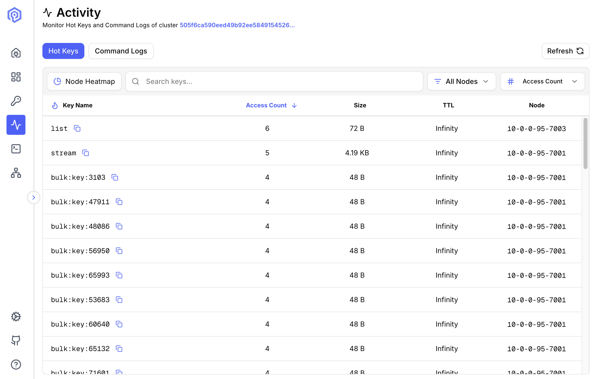
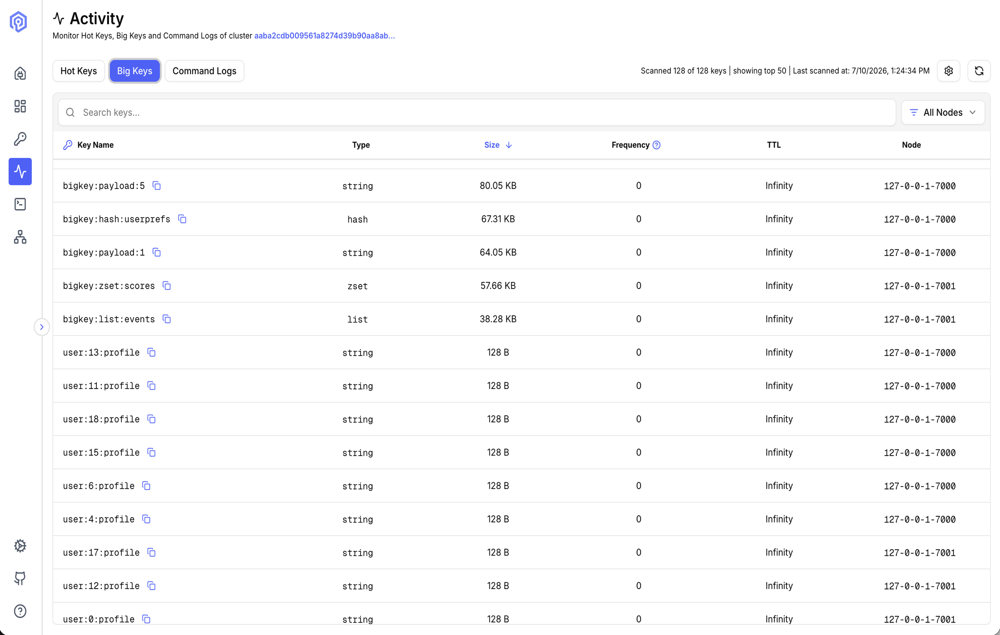
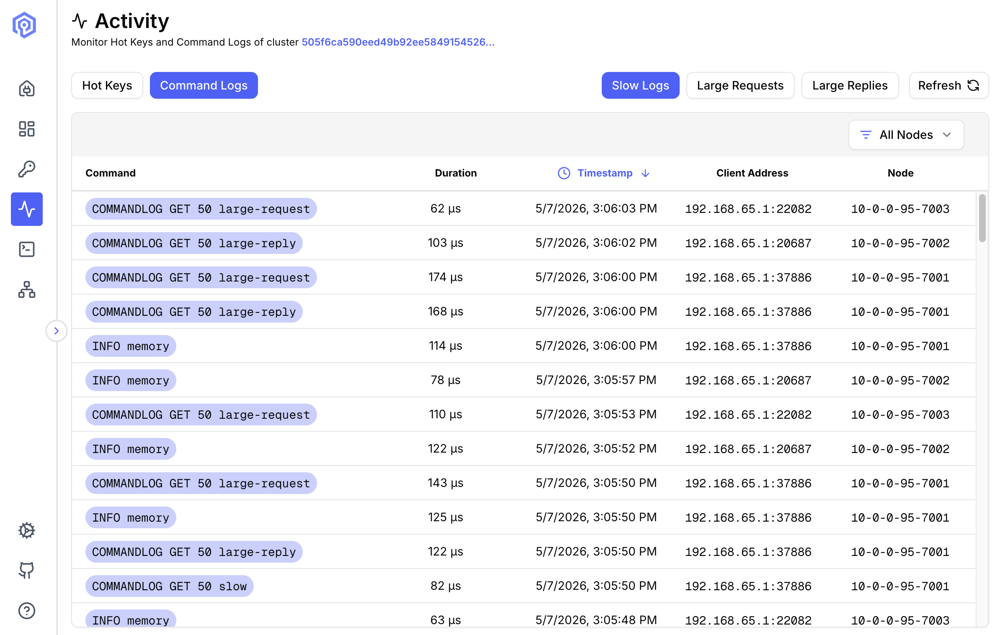
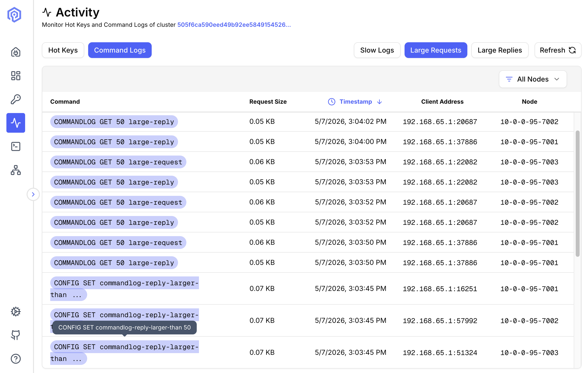
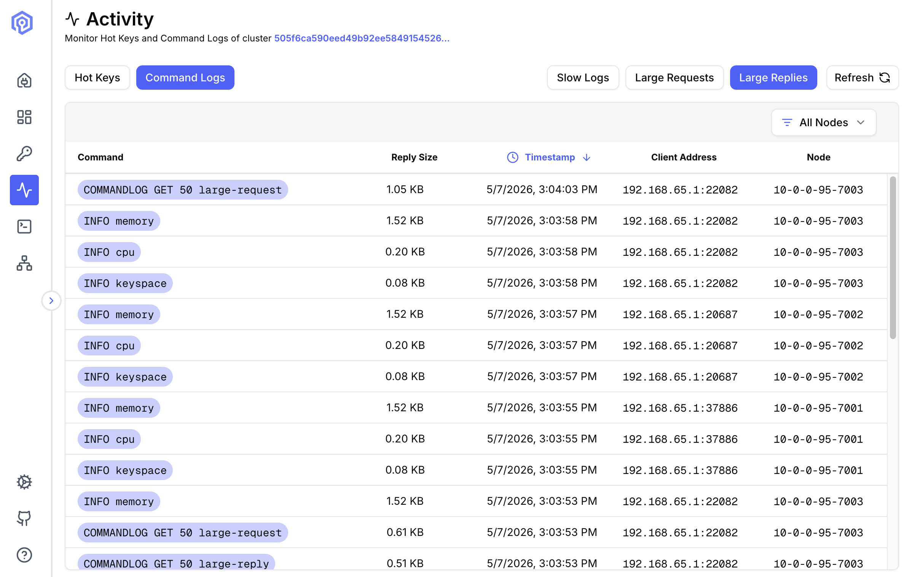

The Activity view provides real-time visibility into hot keys, big keys, and [command logs](https://valkey.io/commands/commandlog-get/) across your cluster.

## Hot Keys Monitoring

Track the most frequently accessed keys in your cluster.



### What are Hot Keys?

Hot keys are keys that receive disproportionately high traffic, potentially causing:
- Performance bottlenecks
- Uneven load distribution
- Memory pressure on specific nodes

Valkey Admin supports two detection methods: **Hot Slots** (recommended) and **Monitor-based detection**.

### Hot Slots Detection (Recommended)

Uses the `CLUSTER SLOT-STATS` command to identify hot slots by CPU usage, network ingress, and network egress. This is the preferred method as it has **no performance impact** on your cluster.

**Requirements:**
- Valkey 8.0+ (`CLUSTER SLOT-STATS` was introduced in Valkey 8.0)
- `cluster-slot-stats-enabled` set to `yes`
- LFU eviction policy (`allkeys-lfu` or `volatile-lfu`) configured on the cluster
- Cluster mode (not available for standalone instances)

When all conditions are met, Valkey Admin queries each shard's slot statistics, identifies the hottest slots by `cpu-usec`, and resolves the keys within those slots. The number of hot keys returned can be adjusted using the configure button in the Activity view.

:::note
The access count shown for hot slots keys is the LFU logarithmic frequency (0–255), not a raw access count. A key accessed millions of times may show a frequency of ~70.
:::

### Monitor-based Detection

Uses the Valkey `MONITOR` command to capture all commands in real time, then aggregates key access frequency from the command stream. Works with any Valkey or Redis version, in both standalone and cluster modes.

When you start monitoring, four settings control the sampling behavior:

- **Duration:** How long each sampling run captures commands (default: 10 seconds).
- **Interval:** How long to wait between sampling runs (default: 10 seconds).
- **Max Commands Per Run:** Maximum commands captured per cycle (default: 1,000,000). Lower values reduce memory usage on busy clusters.
- **Cutoff Frequency:** Minimum access count for a key to be considered hot (default: 100). Lower values show more keys; higher values surface only the most active keys.

This creates a repeating cycle: capture for *duration*, pause for *interval*, capture again. The hot keys displayed are from the most recent sampling run.

**Cluster behavior:**
- **Web/Docker mode:** Monitoring starts on all primary nodes simultaneously.
- **Desktop (Electron) mode:** Monitoring only starts on nodes you have explicitly connected to.

In both modes, hot keys are aggregated across all monitored nodes and sorted by access count.

If some nodes are unreachable when monitoring starts, the reachable nodes still start (and apply any changed settings); monitoring is reported as running, and the failed nodes are listed in a separate partial-data warning.

:::caution
`MONITOR` has a performance impact on the server — it streams every command to the monitoring client. Best suited for short diagnostic sessions, not continuous monitoring.
:::

When hot slots requirements are not met, Valkey Admin prompts you to start monitoring to calculate hot keys.


## Big Keys

Identify the largest keys in your keyspace by memory usage. Big Keys scans a sample of keys using `SCAN` and ranks them by `MEMORY USAGE`.



### How It Works

The scan iterates through the keyspace up to a configurable limit and returns the top N largest keys. It does **not** walk the entire keyspace by default.

For cluster connections, each primary node is scanned independently and results are merged into a single ranked list showing which node owns each key.

### Configuration

Configure these settings using the configure button in the Activity view before starting a scan:

| Setting | Default | Description |
|---------|---------|-------------|
| **Scan Limit** | `10,000` | Maximum keys to sample. Higher values are more thorough but slower. |
| **Top N** | `50` | Number of largest keys to return. |

### Results

Each result shows:

- **Key**: Key name
- **Size**: Memory usage in bytes (via `MEMORY USAGE` with 5-element sampling)
- **Type**: Data structure type (string, hash, list, set, zset, stream)
- **TTL**: Time to live, or `-1` if no expiry
- **Node**: Owning primary node (cluster mode only)
- **Access Frequency**: LFU logarithmic frequency via `OBJECT FREQ` (0–255 scale, requires LFU eviction policy)

:::note
Access frequency requires an LFU eviction policy (`allkeys-lfu` or `volatile-lfu`). Without it, frequency shows `0`. The value is logarithmic — a key accessed millions of times may show ~70.
:::

---

## Command Logs

Command Logs ([`COMMANDLOG`](https://valkey.io/commands/commandlog-get/)) capture commands that exceed configured thresholds for execution time, request size, or reply size. They replace the legacy `SLOWLOG` interface and require Valkey 8.1+.

Thresholds can be adjusted using the configure button in the Activity view, or via environment variables (see [Server Configuration](/configuration/server/)).

### Slow Commands

Monitor commands that take longer than expected to execute.



Slow command logs record commands exceeding a configured execution time threshold, helping identify:
- Inefficient commands
- Large data operations
- Potential optimization targets

**Configuration:**

```bash
# Log commands taking longer than 10ms (value in microseconds)
CONFIG SET commandlog-slow-execution-time-threshold 10000
```

Each entry shows:

- **Timestamp**: When command was executed
- **Duration**: Execution time (microseconds)
- **Command**: Full command text
- **Arguments**: Command arguments (abbreviated if large)
- **Client Address**: Source of the command

### Large Requests

Track commands with large input payloads.



Large requests can saturate network bandwidth, increase memory usage, block other operations, and slow down replication.

**Configuration:**

```bash
# Log requests larger than 1KB (value in bytes)
CONFIG SET commandlog-request-larger-than 1000
```

Each entry shows:

- **Request Size**: Payload size in bytes
- **Command**: Operation type
- **Key**: Target key
- **Timestamp**: When received
- **Client**: Source address

### Large Replies

Monitor commands returning large response payloads.



Large replies indicate oversized data structures, inefficient queries, or potential network saturation.

**Configuration:**

```bash
# Log replies larger than 1KB (value in bytes)
CONFIG SET commandlog-reply-larger-than 1000
```

Each entry shows:

- **Reply Size**: Response payload size
- **Command**: Query that generated response
- **Duration**: Time to generate and send
- **Node**: Source node
- **Client**: Destination address

### Common Offenders

- `KEYS *`: Scans entire keyspace (use SCAN instead)
- Large `HGETALL`: Fetching huge hashes
- `SORT`: Without LIMIT on large sets
- `SMEMBERS` / `LRANGE` on large collections without limits

## Next Steps

- Optimize queries found in the [Send Command](/features/send-command/)
- Analyze key distribution in [Key Browser](/features/key-browser/)
- Review cluster health on the [Dashboard](/features/dashboard/)
