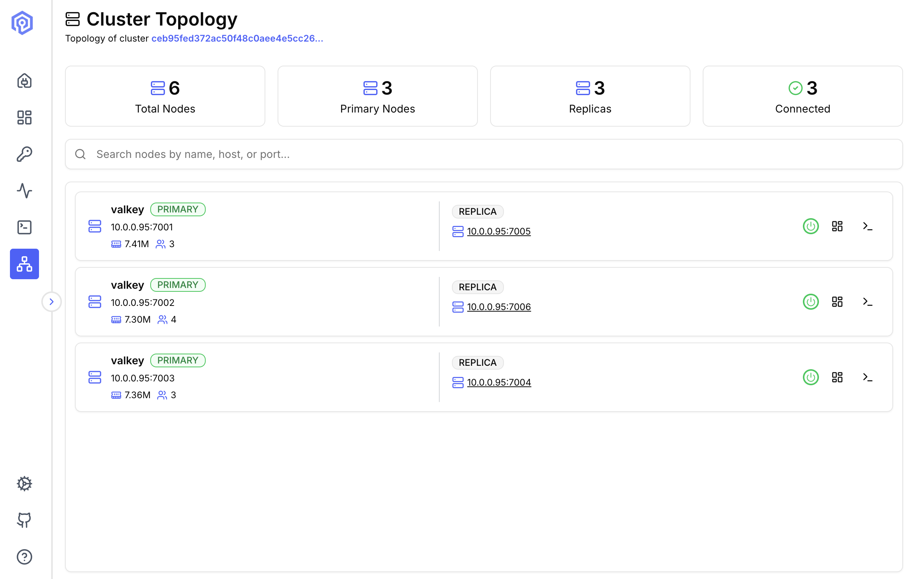

The Cluster Topology view provides an interactive table of your Valkey cluster's nodes, showing replication relationships and connection status at a glance.

## Overview

Understand your cluster architecture with a structured node table that groups each primary with its replica, giving you a clear picture of your replication layout.



## Cluster Statistics

At the top of the page, five summary cards display key cluster metrics:

- **Total Nodes**: Total number of nodes in the cluster (primaries + replicas)
- **Cluster Memory**: Memory used across the cluster, out of the total memory limit
- **Total Ops/Sec**: Operations per second across the cluster
- **Cluster Hit Ratio**: Share of key lookups that found the key
- **Nodes Flagged**: Number of primaries with **High** utilization

## Node List

### Layout

Nodes are displayed in a table. Each primary row is followed by rows for its replicas.

### Node Display

Each node shows its **address** (e.g. `192.168.18.6:7001`) and a `PRIMARY` or `REPLICA` **role badge**. Primary rows also show:

- **Utilization**: `Low`, `Normal` or `High`, based on the higher of memory and CPU usage. Hover the badge for details. See [Utilization Levels](#utilization-levels).
- **Memory**: Memory used out of the node's `maxmemory` limit (e.g. `70.81M / 100 MB`), or `∞` when no limit is set
- **CPU**: CPU usage
- **Ops/Sec**: Operations per second
- **Hit Ratio**: Share of key lookups that found the key
- **Conns**: Number of connected clients

### Utilization Levels

Memory and CPU are each assigned a level, and the badge shows the higher of the two. For example, a node at 30% memory and 90% CPU shows **High**.

| Level | Memory | CPU |
|---|---|---|
| **Low** | Below 70% | Below 60% |
| **Normal** | 70% to below 90% | 60% to below 85% |
| **High** | 90% or more | 85% or more |

- **Memory** is `used_memory` as a share of `maxmemory`. If `maxmemory` is not set, memory is not counted: the level is based on CPU alone, the badge has a dashed border, and the node's memory limit shows as `∞`. If any node has no `maxmemory`, the **Cluster Memory** card's limit also shows `∞`.
- **CPU** is the main thread's CPU time as a share of one core, measured between two consecutive samples. When you first open the page, CPU may show `—` until the next refresh.
- If neither value is available, no badge is shown.

Memory has higher thresholds than CPU because a cache is expected to run close to its memory limit, while sustained high CPU on the main thread means the node is close to saturation.

### Searching and Filtering

Use the search bar to filter nodes by host or port. Narrow the list further with the **role** and **utilization** filters. The count of matching nodes is shown next to the filters.

## Refresh Interval

The page refreshes node metrics, utilization levels, and the cluster statistics every 5 seconds while it is open. Refreshing stops when you leave the page.

## Node Actions

Each primary row includes action icons on the right side:

- **Power**: Connect to the primary node
- **Dashboard**: Go to dashboard of the node
- **Terminal**: Open the Send Command interface for the node

## Replication Structure

Each primary is followed by its replica:

```
Primary: 192.168.18.6:7001  →  Replica: 192.168.18.6:7005
Primary: 192.168.18.6:7002  →  Replica: 192.168.18.6:7006
Primary: 192.168.18.6:7003  →  Replica: 192.168.18.6:7004
```


## Next Steps

- Monitor cluster performance on the [Dashboard](/features/dashboard/)
- Track operations with [Activity](/features/activity/)
- Execute cluster commands in the [Send Command](/features/send-command/)