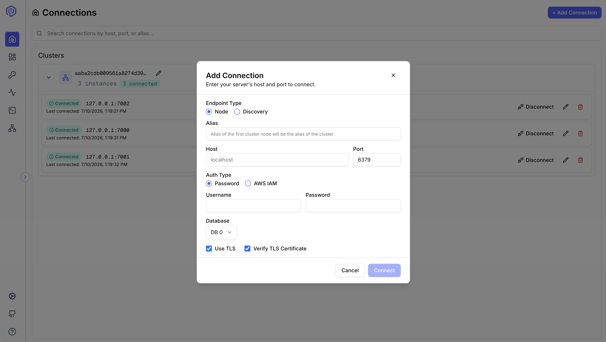

Valkey Admin supports connecting to both standalone Valkey instances and clusters. The connection modal provides two endpoint types and optional database selection.

## Endpoint Types

### Node Endpoint

A node endpoint connects directly to a specific Valkey instance by its host and port. Use this when you know the exact address of the node you want to reach.

After connecting, Valkey Admin checks whether the node belongs to a cluster (`cluster_enabled:1` in `INFO`). If it does, the full cluster topology is discovered automatically from that single node — you still get the complete cluster experience.

**When to use:**
- Connecting to a standalone Valkey instance
- Connecting to a specific node in a cluster when you know its address
- Connecting to managed services where you have a direct node hostname

### Discovery Endpoint

A discovery endpoint connects via a cluster configuration endpoint (e.g., ElastiCache `clustercfg.*` endpoints). These DNS names can resolve to any node in the cluster.

Valkey Admin discovers the full cluster topology from whichever node the DNS resolves to, then starts metrics collection for all primary nodes.

**When to use:**
- Connecting to an ElastiCache cluster via its configuration endpoint
- Any DNS endpoint that load-balances across cluster nodes

:::note
Both endpoint types result in the same cluster experience when connecting to a cluster node. The difference is how the initial connection is established, not what you see after connecting.
:::

## Numbered Databases

Valkey supports multiple logical databases per instance (default: 16, numbered `0` through `15`, configurable via `databases`). The connection modal exposes a **Database** number field accepting any non-negative integer — there is no static upper bound in the UI, because the valid range depends on the target server.

At connect time the server validates the requested index against the live server's configured count (`CONFIG GET databases`, or `cluster-databases` for Valkey 9+ clusters) and rejects out-of-range values with a message naming the configured count and valid range. Once connected, the learned count is shown in the Edit Connection form as the valid range for that server.

Each `(host, port, db)` combination creates an independent client connection. Switching databases opens a new connection rather than running `SELECT` on an existing one — operations in one database never affect another.

### Cluster Mode

- **Valkey 9.0+**: Multiple databases are supported in cluster mode. Set `--cluster-databases <n>` on every cluster node to enable.
- **Below 9.0**: Only `db 0` is available in cluster mode.

:::note
The connection modal always disables the database field when connecting via a discovery endpoint, regardless of Valkey version.
:::

### Standalone Mode

All Valkey versions support numbered databases in standalone mode, up to the server's configured `databases` limit.

## Authentication

Valkey Admin supports two authentication methods:

### Password Authentication

Provide a username and password. If no username is specified, the default ACL user is used.

### AWS IAM Authentication

For ElastiCache clusters with IAM authentication enabled, provide:
- **Username**: The IAM-enabled user ID
- **AWS Region**: The region where the cluster is deployed
- **Replication Group ID**: The ElastiCache cluster name

Valkey Admin generates short-lived IAM auth tokens automatically.

## TLS

Enable TLS for encrypted connections. Optionally verify the server certificate — disable verification only for self-signed certificates in development environments.

## Next Steps

- Browse keys after connecting with the [Key Browser](/features/key-browser/)
- Monitor performance in [Activity](/features/activity/)
- Configure pre-configured connections via [environment variables](/deployment/docker/#with-pre-configured-connection)
