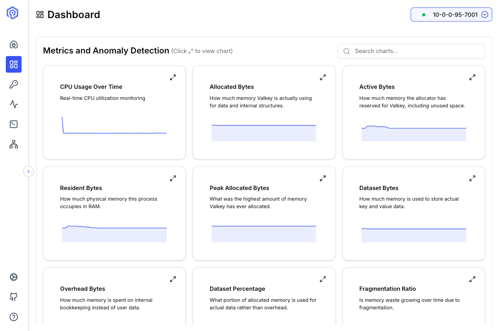

The Valkey Admin dashboard provides a comprehensive overview of your cluster's health, performance, and key metrics at a glance.

## Overview

The dashboard is your central hub for monitoring cluster node activity, displaying real-time metrics, node status, and performance indicators.

## Key Metrics

### Cluster Health

- **Cluster Node DropDown**: View online/offline status of all cluster nodes
- **Node Metrics**: View INFO command metrics
- **Key Type Distribution**: Share of stored key types
- **Memory Usage**: Monitor memory consumption across nodes
- **CPU Usage**: Real-time CPU utilization metrics

## Real-Time Usage Metrics

The dashboard shows CPU and memory usage metrics at configurable intervals:

- **Default**: 1 hour
- **Configurable**: Adjust to see usage over 6H and 12H

### Metrics and Anomaly Detection

The metrics view displays a grid of time-series charts, giving a detailed breakdown of CPU and memory behavior over the selected interval.

| Chart | Description |
|-------|-------------|
| **CPU Usage Over Time** | Real-time CPU utilization monitoring |
| **Allocated Bytes** | How much physical memory is actively being used by data and internal structures |
| **Active Bytes** | How much memory has been accessed or touched by Valkey, including unused bytes |
| **Resident Bytes** | How much actual physical memory this process occupies in RAM |
| **Peak Allocated Bytes** | The maximum amount of memory jemalloc has ever allocated to Valkey |
| **Dataset Bytes** | How much memory is used to store actual Valkey data |
| **Overhead Bytes** | Memory spent on internal, non-data structures — Valkey's own overhead |
| **Dataset Percentage** | Fraction of allocated memory being used for actual data |
| **Fragmentation Ratio** | A value growing over time may indicate memory fragmentation |

Anomaly detection highlights unusual patterns across these charts, making it easier to spot memory leaks, unexpected spikes, or fragmentation trends before they affect cluster performance.

## Next Steps

- Explore the [Key Browser](/features/key-browser/) for managing your data
- Use the [Send Command interface](/features/send-command/) to execute operations
- View [Cluster Topology](/features/cluster-topology/) for node relationships
