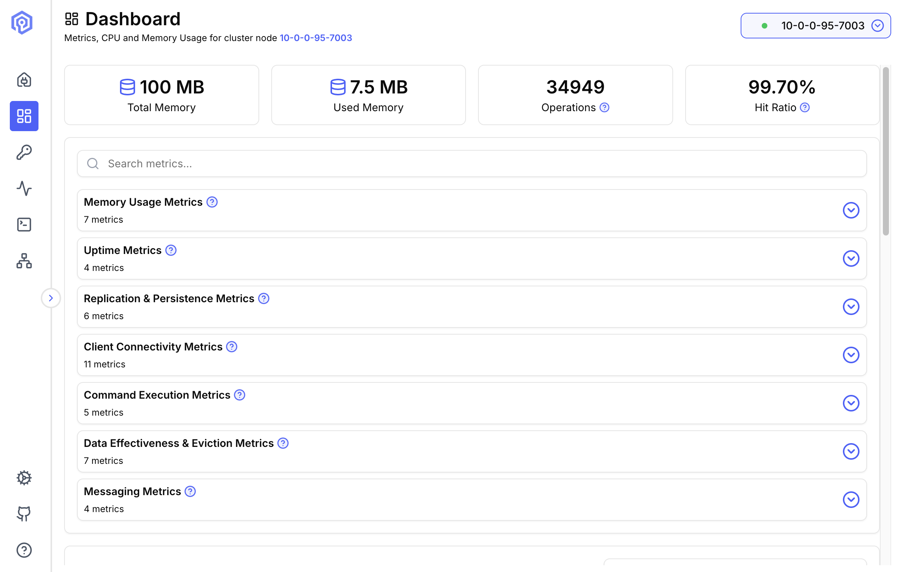
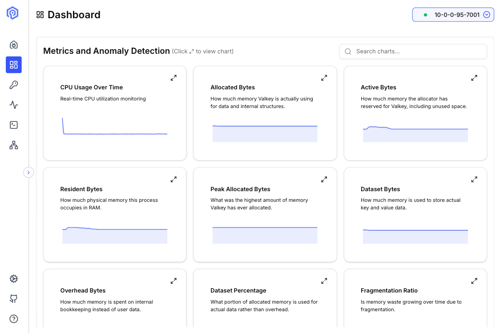

The Valkey Admin dashboard provides a comprehensive overview of your cluster's health, performance, and key metrics at a glance.

## Overview

The dashboard is your central hub for monitoring cluster node activity, displaying real-time metrics, node status, and performance indicators.

## Key Metrics

### Stat Cards

The top of the dashboard displays four summary cards for the connected node:

- **Total Memory**: The server's configured `maxmemory` (or total system memory if unbounded)
- **Used Memory**: Current memory consumption
- **Operations**: Total commands processed
- **Hit Ratio**: Cache hit rate (keyspace hits vs misses)

### Metric Groups

Below the stat cards, searchable accordion sections display detailed metrics from the Valkey `INFO` command:

- **Memory Usage Metrics**: Breakdown of memory allocation (dataset, scripts, peak, overhead, etc.)
- **Uptime Metrics**: Server uptime, evicted scripts, network I/O bytes
- **Replication & Persistence**: RDB save status, replication backlog, sync state
- **Client Connectivity**: Connected clients, blocked clients, rejected connections, reads/writes processed
- **Command Execution**: Total commands, error replies, blocking keys
- **Data Effectiveness & Eviction**: Evicted/expired keys, hit/miss counts, cached scripts
- **Messaging**: Pub/Sub channels, patterns, and clients

Use the search bar to filter metrics by name across all groups.

## Real-Time Usage Metrics

The dashboard shows CPU and memory usage metrics at configurable intervals:

- **Default**: 1 hour
- **Configurable**: Adjust to see usage over 6H and 12H

### Metrics and Anomaly Detection

The metrics view displays a grid of time-series charts, giving a detailed breakdown of CPU and memory behavior over the selected interval.

| Chart | Description |
|-------|-------------|
| **CPU Usage Over Time** | Real-time CPU utilization monitoring |
| **Allocated Bytes** | How much physical memory is actively being used by data and internal structures |
| **Active Bytes** | How much memory has been accessed or touched by Valkey, including unused bytes |
| **Resident Bytes** | How much actual physical memory this process occupies in RAM |
| **Peak Allocated Bytes** | The maximum amount of memory jemalloc has ever allocated to Valkey |
| **Dataset Bytes** | How much memory is used to store actual Valkey data |
| **Overhead Bytes** | Memory spent on internal, non-data structures — Valkey's own overhead |
| **Dataset Percentage** | Fraction of allocated memory being used for actual data |
| **Fragmentation Ratio** | A value growing over time may indicate memory fragmentation |

Anomaly detection highlights unusual patterns across these charts, making it easier to spot memory leaks, unexpected spikes, or fragmentation trends before they affect cluster performance.

## Next Steps

- Explore the [Key Browser](/features/key-browser/) for managing your data
- Use the [Send Command interface](/features/send-command/) to execute operations
- View [Cluster Topology](/features/cluster-topology/) for node relationships
