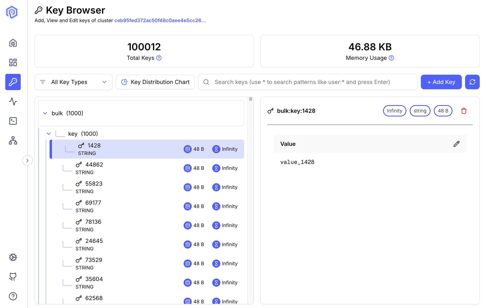

The Key Browser provides a powerful interface for exploring and managing keys stored in your Valkey cluster.

## Overview

Navigate through your keyspace with an intuitive interface that supports filtering, searching, and adding.



## Key Features

### Browsing Keys

- **Tree View**: Navigate keys organized by namespace separators (`:`)
- **List View**: View all keys in a flat list format
- **Pagination**: Handle large keyspaces efficiently
- **Sorting**: Sort by name, type, TTL, or size

### Search and Filter

#### Pattern Matching

Use Redis/Valkey pattern matching syntax:
```
user:*          # All keys starting with "user:"
*:session       # All keys ending with ":session"
user:*:cache    # Keys matching the pattern
```

#### Type Filtering

Filter keys by data type:
- **String**: Simple key-value pairs
- **Hash**: Field-value maps
- **List**: Ordered collections
- **Set**: Unordered unique collections
- **Sorted Set**: Scored, ordered sets
- **Stream**: Append-only logs

## Key Operations

### Viewing Keys

#### String Values
View string values with syntax highlighting for JSON, XML, and other formats.

#### Hash Fields
Display all fields and values in a table format.

#### List Elements
Browse list elements with pagination.

#### Set Members
View all members of a set.

#### Sorted Set Entries
Display entries with their scores.

### Editing Keys

- **Update Value**: Modify existing key values
- **Add Fields**: Insert new hash fields or list elements

## Key Details Panel

Click any key to view detailed information:

- **Name**: Key Name
- **Type**: Data structure type
- **Size**: Actual size in bytes
- **TTL**: Time to live (if set)

### Value Viewer

- **Raw View**: Display raw value for String types
- **Table View**: Hash, List, Set, Stream, and Zset types
- **Json View**: JSON data


## Next Steps

- Execute commands with the [Send Command interface](/features/send-command/)
- Monitor key access with [Monitoring tools](/features/monitoring/)
- Visualize data distribution in [Cluster Topology](/features/cluster-topology/)
