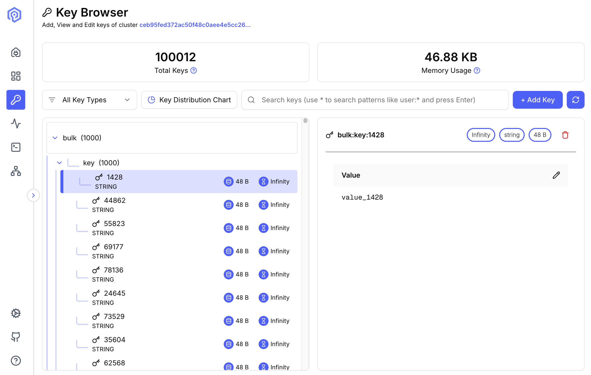

The Key Browser provides a powerful interface for exploring and managing keys stored in your Valkey cluster.

## Overview

Navigate through your keyspace with an intuitive interface that supports filtering, searching, and adding.



## Key Features

### Browsing Keys

- **Tree View**: Navigate keys organized by namespace separators (`:`)
- **Pagination**: Scroll near the bottom or select **Load more** to fetch the next batch of up to 200 keys. Browsing is no longer capped at 1,000 keys.
- **Ordering**: Keys are sorted across loaded results, not across the entire database. Loading more can insert keys earlier in the tree.
- **Search and types**: Pattern and type filters run during scanning, before fetching key metadata. Changing a filter or refreshing starts a new scan.

Each request performs bounded scan work. A sparse search may return no keys while more scan work remains; select **Load more** to continue. The loaded count is distinct from the database-wide **Total Keys** count. Memory and distribution statistics describe loaded keys only.

Opening the Key Distribution Chart uses those already-loaded results; it does not reset search, type filters, or scan progress.

Scans are not snapshots: concurrent additions and deletions can change results. Refresh to begin a new scan after external changes. Continuations expire after 30 minutes and are scoped to the current browser connection; refresh after expiry or reconnection.

### Search and Filter

#### Pattern Matching

Use Redis/Valkey pattern matching syntax:
```
user:*          # All keys starting with "user:"
*:session       # All keys ending with ":session"
user:*:cache    # Keys matching the pattern
```

#### Type Filtering

Filter keys by data type:
- **String**: Simple key-value pairs
- **Hash**: Field-value maps
- **List**: Ordered collections
- **Set**: Unordered unique collections
- **Sorted Set**: Scored, ordered sets
- **Stream**: Append-only logs
- **JSON**: ReJSON-style document values (requires the JSON module)

## Key Operations

### Viewing Keys

#### String Values
View string values with syntax highlighting for JSON, XML, and other formats.

#### Hash Fields
Display fields and values in a paginated table format.

#### List Elements
Browse list elements with pagination.

#### Set Members
View members of a set with pagination.

#### Sorted Set Entries
Display entries with their scores, paginated for large collections.

All collection types (hash, list, set, sorted set) use pagination to handle large data structures efficiently. Only a page of elements is loaded at a time, preventing the browser from blocking on keys with millions of members.

### Editing Keys

- **Update Value**: Modify existing key values
- **Add Fields**: Insert new hash fields or list elements

## Key Details Panel

Click any key to view detailed information:

- **Name**: Key Name
- **Type**: Data structure type
- **Size**: Actual size in bytes
- **TTL**: Time to live (if set)

### Value Viewer

- **Raw View**: Display raw value for String types
- **Table View**: Hash, List, Set, Stream, and Zset types
- **Json View**: JSON data

## Switching Databases

Each `(host, port, db)` triple maps to its own client connection on the server, so the Key Browser is always scoped to the database you connected to. Switching to a different `db` opens a new client side-by-side with the existing one rather than issuing `SELECT` against an existing client, so operations like `KEYS`, `SET`, and `DEL` against one database never affect keys in another database on the same node. For cluster connections this only applies when the Valkey server is at version `9.0.0` or higher; earlier cluster servers always operate on `db` `0` and a non-zero `db` is rejected at connect time.

## Pagination Protocol

The `keyBrowser/getKeysRequested` websocket action accepts `connectionId`, optional `pattern` and `keyType`, an opaque `cursor` from the previous response, and a `requestId` echoed in success/failure replies. Omit the cursor to start over. `getKeysFulfilled` includes `keys`, database-wide `totalKeys`, and `cursor`; only cursor `"0"` means the scan is finished. Clients must deduplicate keys and discard replies for superseded request IDs. A request returns at most 200 keys and performs at most eight continuation SCAN calls after initial node discovery. The legacy `count` field is accepted but the server controls scan batch size.

Continuation tokens are bound to the websocket, Valkey client and query. The server retains at most 32 tokens per websocket for 30 minutes; invalid or expired tokens produce `getKeysFailed` with `restartRequired: true` and offer **Restart scan**. Before resuming a cluster scan, an additional SCAN probe with COUNT 1 to all current primaries checks that saved primary addresses are still present without advancing the saved scan. A missing primary offers **Restart scan**; ordinary command failures retain the continuation for **Retry**.

## Next Steps

- Execute commands with the [Send Command interface](/features/send-command/)
- Monitor key access with [Activity](/features/activity/)
- Visualize data distribution in [Cluster Topology](/features/cluster-topology/)
