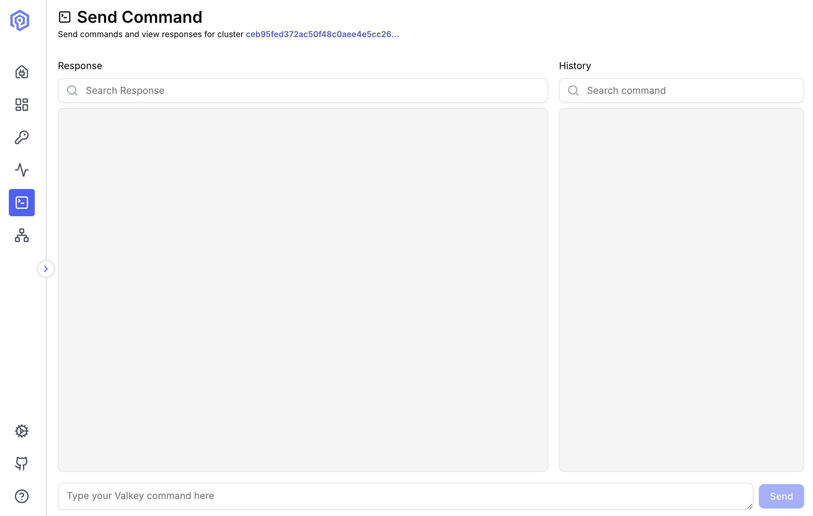

The Send Command interface provides a powerful terminal-like environment for executing Valkey commands directly against your cluster.

## Overview

Execute any Valkey command with syntax highlighting and command history.



## Basic Usage

### Executing Commands

Type commands exactly as you would in `valkey-cli`:

```
GET mykey
SET mykey "Hello World"
HGETALL user:1001
LPUSH mylist "item1" "item2"
```

Press `Enter` to execute. Results are displayed below the command input.

## Features

### Response View

Commands are highlighted for better readability:
- **Search**: Search command response 
- **Copy**: Copy command response
- **Values**: White
- **Keys**: Gray

### Command History

Navigate through previously executed commands:
- **Search**: Search previously executed commands
- **Copy**: Copy command
- **Run**: Run the command again
- **Compare**: Compare the results two commands

## Next Steps

- Browse keys with the [Key Browser](/features/key-browser/)
- Monitor command performance in [Monitoring](/features/monitoring/)
- Understand cluster layout in [Cluster Topology](/features/cluster-topology/)
