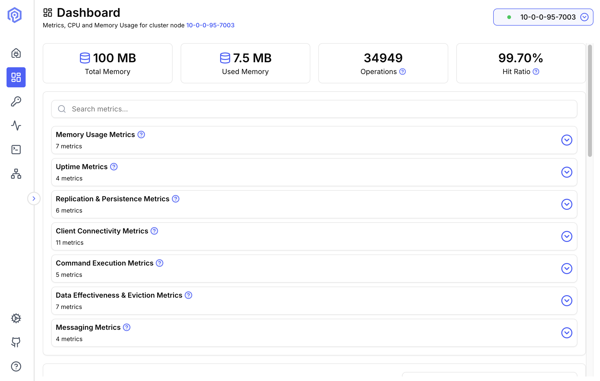
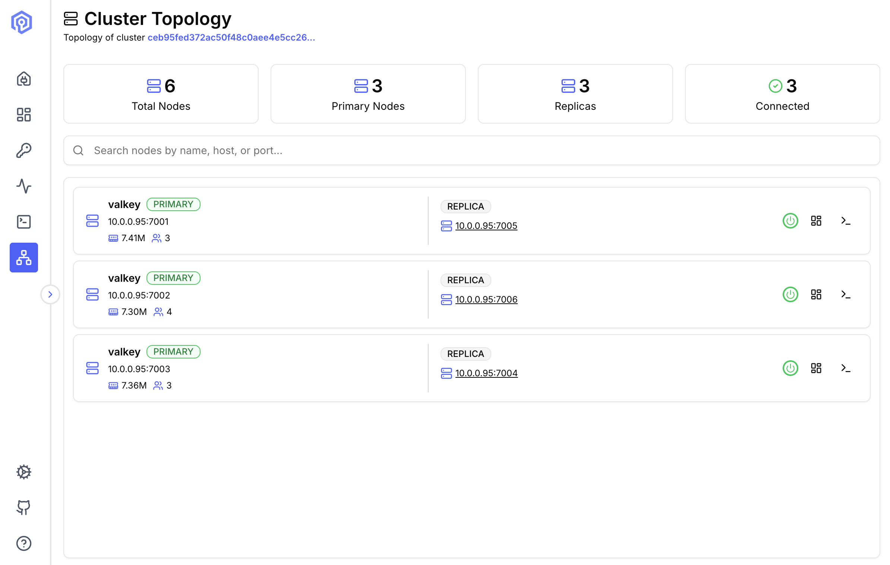

import { Card, CardGrid, Tabs, TabItem } from '@astrojs/starlight/components';

## What is Valkey Admin?

Valkey Admin is an open-source observability and management tool from the [Valkey](https://valkey.io) project that brings cluster visibility, data inspection, and troubleshooting into a single view. It ships as a native desktop application for macOS and Linux, and as a containerized web deployment on Docker and Kubernetes. Valkey Admin provides real-time cluster dashboards, topology visualization with per-node metrics, a key browser, hot key identification, and [COMMANDLOG](https://valkey.io/commands/commandlog-get/) aggregated across the cluster.

---

## Features

<CardGrid>
	<Card title="Dashboard" icon="magnifier">
		Real-time metrics including memory usage, CPU, connected clients, hit ratio, and command throughput.
	</Card>
	<Card title="Key Browser" icon="puzzle">
		Browse, search, inspect, and edit keys across all data types (String, Hash, List, Set, Sorted Set, Stream, JSON).
	</Card>
	<Card title="Send Command" icon="rocket">
		Execute Valkey commands with response formatting and command history.
	</Card>
	<Card title="Cluster Topology" icon="setting">
		Visual map of shards, primaries, and replicas with per-node metrics.
	</Card>
	<Card title="Hot Keys Monitoring" icon="star">
		Identify frequently accessed keys across all cluster nodes.
	</Card>
	<Card title="Command Logs" icon="warning">
		View slow commands, large requests, and large replies aggregated across the cluster.
	</Card>
</CardGrid>

---

## See It in Action

<Tabs>
  <TabItem label="Dashboard">
    

    **Real-time cluster monitoring** with metrics for memory, CPU, connections, and throughput across all nodes.
  </TabItem>

  <TabItem label="Key Browser">
    

    **Powerful key management** with pattern matching, type filtering, and support for all data structures (strings, hashes, lists, sets, sorted sets, streams).
  </TabItem>

  <TabItem label="Send Command">
    

    **User friendly Send Command** with syntax highlighting, response searching and command history.
  </TabItem>

  <TabItem label="Cluster Topology">
    

    **Visual cluster topology** displaying primary-replica relationships, slot assignments, and node connection status.
  </TabItem>
</Tabs>

---

## Activity

<CardGrid>
	<Card title="Hot Keys" icon="star">
		

		Track the most accessed keys in real-time to identify potential bottlenecks and optimize data distribution.
	</Card>

	<Card title="Slow Logs" icon="warning">
		

		Monitor slow logs with detailed timing information to optimize performance-critical operations.
	</Card>

	<Card title="Large Requests" icon="document">
		

		Detect large request payloads that may impact network performance and cause blocking operations.
	</Card>

	<Card title="Large Replies" icon="document">
		

		Identify commands returning large responses to optimize queries and reduce network overhead.
	</Card>
</CardGrid>

---

## License

Valkey Admin is released under the **Apache License 2.0** - free for commercial and personal use.

[View license details →](/reference/license/)
