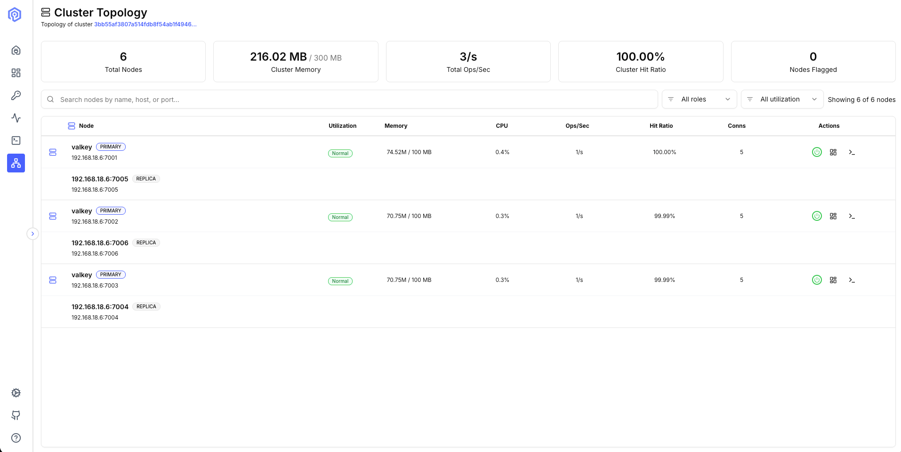
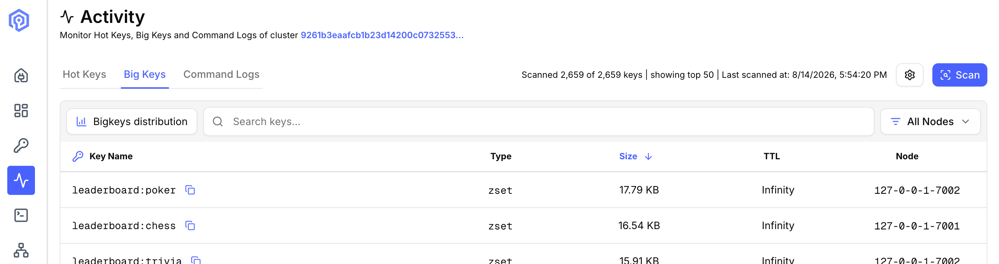
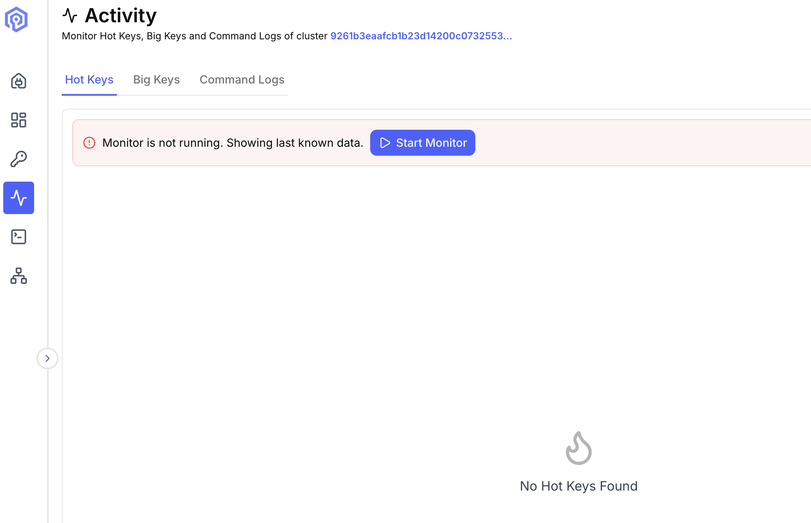
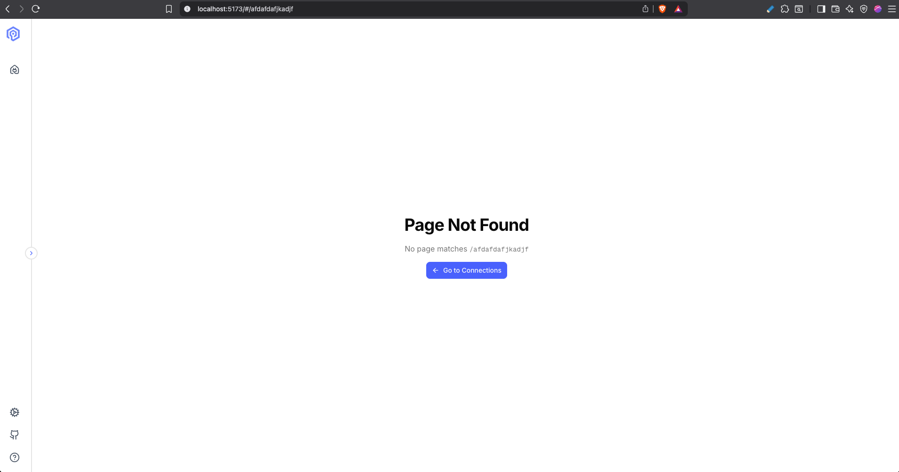

## v1.2.0

Release Date: September 2026

### Key Features

**Cluster Topology Utilization View**: The Cluster Topology page now shows load as well as layout. Summary cards show total nodes, cluster memory (used / limit), total ops/sec, cluster hit ratio, and flagged nodes. The node table groups replicas under their primary and shows each primary's memory against `maxmemory` (or host RAM when `maxmemory` is unset), main-thread CPU, ops/sec, hit ratio, and connected clients. Each primary gets a Low, Normal, or High badge, and High primaries (memory ≥ 90% or CPU ≥ 85%) are highlighted. You can filter nodes by role or utilization level, and the view refreshes every 5 seconds while open. ([#486](https://github.com/valkey-io/valkey-admin/pull/486))

**Safer Defaults**: The web server, and the metrics collectors it spawns, now listen on loopback unless you opt in. Collectors must authenticate to register, and TLS connections configured through environment variables verify certificates. The desktop app protects its local connection with a per-launch token. Some of these change behavior on upgrade, so review Changed Defaults and Upgrade Notes below. ([#490](https://github.com/valkey-io/valkey-admin/pull/490), [#494](https://github.com/valkey-io/valkey-admin/pull/494), [#504](https://github.com/valkey-io/valkey-admin/pull/504), [#516](https://github.com/valkey-io/valkey-admin/pull/516), [#521](https://github.com/valkey-io/valkey-admin/pull/521))

### Changed Defaults

Review these before upgrading. See the [server](/configuration/server/) and [metrics](/configuration/metrics/) configuration references for details.

| Setting | v1.1.1 | v1.2.0 | What to do |
|---------|--------|--------|------------|
| Server bind address (`SERVER_BIND_HOST`, new) | All interfaces (desktop app: `127.0.0.1`) | `127.0.0.1`. Kubernetes mode (`DEPLOYMENT_MODE=K8`) and the Docker image use `0.0.0.0` | If you run the server directly on a host or VM and open it from another machine, set `SERVER_BIND_HOST=0.0.0.0`. Web mode has no built-in authentication, so expose it only behind access controls ([#521](https://github.com/valkey-io/valkey-admin/pull/521)) |
| TLS certificate verification for connections configured through environment variables (`VALKEY_VERIFY_CERT`) | Off unless `"true"` | On unless `"false"` | Connections to servers with self-signed or private-CA certificates fail until you set `VALKEY_VERIFY_CERT=false` ([#490](https://github.com/valkey-io/valkey-admin/pull/490)) |
| Bind address of metrics collectors spawned by the server (`METRICS_BIND_HOST`) | `0.0.0.0` | `127.0.0.1`. Kubernetes sidecars keep `0.0.0.0` | Nothing, unless something reached a spawned collector from another host ([#494](https://github.com/valkey-io/valkey-admin/pull/494)) |
| Rate limit on `/orchestrator/*` (`ORCHESTRATOR_RATE_LIMIT_MAX`, new) | None | 600 requests per minute per source address | All collectors the server spawns (one per primary or standalone node) share one loopback budget at about 6 requests per minute each. Raise the limit when you monitor close to 100 primaries at once. The symptom is `Register failed: 429` in collector logs ([#504](https://github.com/valkey-io/valkey-admin/pull/504)) |
| Collector signature age limit (`ORCHESTRATOR_AUTH_WINDOW_MS`, new) | None (collector requests were not authenticated) | 60 seconds | Raise it only if collector and server clocks drift apart by more than that ([#504](https://github.com/valkey-io/valkey-admin/pull/504)) |
| Collector client mode (`VALKEY_MODE`, `valkey.mode`) | `cluster` created a cluster client | Ignored, with a warning | Remove the setting. Each collector samples one node, so it always uses a node-local client ([#528](https://github.com/valkey-io/valkey-admin/pull/528)) |

### Upgrade Notes

- **Kubernetes collector key**: Metrics sidecars now sign their register and ping requests. Create the `valkey-admin-orchestrator-key` Secret and expose it as `ORCHESTRATOR_KEY` on the app Deployment and every sidecar; sidecars exit at startup without it. Web, Docker, and desktop generate collector keys automatically. See the [Kubernetes guide](/deployment/kubernetes/) ([#504](https://github.com/valkey-io/valkey-admin/pull/504), [#512](https://github.com/valkey-io/valkey-admin/pull/512))
- **Collector config**: Epics in `config.yml` are identified by `name` only. `type` and `file_prefix` are no longer read, and an epic with an unrecognized name is skipped. The shipped epic names are unchanged. `POST /update-config` now takes `{ "epics": { "<name>": { ... } } }` and rejects unknown fields and out-of-range values ([#501](https://github.com/valkey-io/valkey-admin/pull/501))
- **Desktop app without an OS keyring**: Passwords are no longer saved when the system has no secure store (previously they were saved in cleartext). You are prompted for the password each session ([#522](https://github.com/valkey-io/valkey-admin/pull/522))

### Improvements

- Key Browser search matches anywhere in a key name (`user` searches `*user*`). Input containing `*`, `?`, `[`, or `]` is used as a pattern exactly as typed ([#479](https://github.com/valkey-io/valkey-admin/pull/479))
- Editing a string value keeps its existing TTL ([#488](https://github.com/valkey-io/valkey-admin/pull/488))
- Adding a String or JSON key that already exists fails with an error instead of overwriting it ([#520](https://github.com/valkey-io/valkey-admin/pull/520))
- Binary string values are detected and can't be edited as text ([#520](https://github.com/valkey-io/valkey-admin/pull/520))
- Big Keys has a Scan button, Hot Keys has a Start Monitor button in its toolbar, and cluster connections have an Open button ([#481](https://github.com/valkey-io/valkey-admin/pull/481))

- Connection port is validated (1–65535) with an inline error ([#489](https://github.com/valkey-io/valkey-admin/pull/489))
- Unknown routes show a Not Found page instead of a blank screen ([#487](https://github.com/valkey-io/valkey-admin/pull/487))

- A TTL of `-1` shows "No expiry", and hit ratio shows "-" when there have been no hits or misses ([#531](https://github.com/valkey-io/valkey-admin/pull/531))
- The WebSocket URL includes the page path, so it connects through reverse proxies that serve Valkey Admin under a path prefix ([#471](https://github.com/valkey-io/valkey-admin/pull/471))
- Upgraded Valkey GLIDE to 2.5.2. Valkey Admin connections report a `lib-name` such as `GlideJS(valkey-admin-web:1.2.0)` in `CLIENT LIST` ([#506](https://github.com/valkey-io/valkey-admin/pull/506))

### Security

- Require a per-launch token for the desktop app's WebSocket handshake, so web pages can't connect to its local backend ([#516](https://github.com/valkey-io/valkey-admin/pull/516))
- Never store a cleartext password when no OS keystore is available ([#522](https://github.com/valkey-io/valkey-admin/pull/522))
- Default the server bind to loopback ([#521](https://github.com/valkey-io/valkey-admin/pull/521)), and default TLS certificate verification to on for env-configured connections ([#490](https://github.com/valkey-io/valkey-admin/pull/490))
- Authenticate `/orchestrator/register` and `/orchestrator/ping` with HMAC-signed requests, bind spawned collectors to loopback, and accept only loopback metrics URIs outside Kubernetes ([#494](https://github.com/valkey-io/valkey-admin/pull/494), [#504](https://github.com/valkey-io/valkey-admin/pull/504))
- Scope Valkey client reuse, connection retry, and cluster topology broadcasts to the owning session ([#496](https://github.com/valkey-io/valkey-admin/pull/496), [#499](https://github.com/valkey-io/valkey-admin/pull/499), [#500](https://github.com/valkey-io/valkey-admin/pull/500))
- Validate `POST /update-config` against a strict schema with field bounds ([#501](https://github.com/valkey-io/valkey-admin/pull/501))
- Fix quoted command names bypassing Send Command's blocked-command check, and replace the regex parser to remove a ReDoS ([#472](https://github.com/valkey-io/valkey-admin/pull/472))
- Parse cluster `INFO` into null-prototype objects ([#493](https://github.com/valkey-io/valkey-admin/pull/493))
- Update nanoid, express, body-parser, and qs ([#493](https://github.com/valkey-io/valkey-admin/pull/493), [#526](https://github.com/valkey-io/valkey-admin/pull/526))
- Attach provenance and SBOM attestations to Docker images ([#521](https://github.com/valkey-io/valkey-admin/pull/521))
- Pin GitHub Actions to commit SHAs, and replace the labeler's `pull_request_target` trigger with a `pull_request` + `workflow_run` split ([#491](https://github.com/valkey-io/valkey-admin/pull/491), [#492](https://github.com/valkey-io/valkey-admin/pull/492))
- Fix Kubernetes metrics sidecars being rejected at registration (regressed in v1.1.0) ([#512](https://github.com/valkey-io/valkey-admin/pull/512))
- Fix Cluster Topology not picking up topology changes. The server now re-discovers each cluster every 30 seconds (`TOPOLOGY_REFRESH_INTERVAL`) ([#512](https://github.com/valkey-io/valkey-admin/pull/512))
- Fix hot keys being attributed to the wrong node on Kubernetes ([#528](https://github.com/valkey-io/valkey-admin/pull/528))
- Kubernetes examples seed discovery from the headless Service and wait for the cluster to form before starting the app ([#528](https://github.com/valkey-io/valkey-admin/pull/528))
- Fix shutdown clearing cluster and metrics state before cleanup ran, and drain WebSockets before closing Valkey clients ([#469](https://github.com/valkey-io/valkey-admin/pull/469))
- Reduce log noise from JSON module detection, binary string values, and early metrics requests ([#520](https://github.com/valkey-io/valkey-admin/pull/520))

### Contributors

@ravjotbrar, @ArgusLi, @nassery318, @tkesgar

**Full Changelog**: [v1.1.1...v1.2.0](https://github.com/valkey-io/valkey-admin/compare/v1.1.1...v1.2.0)

**Release**: [GitHub Releases](https://github.com/valkey-io/valkey-admin/releases/tag/v1.2.0)

**Container Images**:
- Docker Hub: `docker pull valkey/valkey-admin:1.2.0`
- GHCR: `docker pull ghcr.io/valkey-io/valkey-admin:1.2.0`
- ECR Public: `docker pull public.ecr.aws/valkey/valkey-admin:1.2.0`

---

## v1.1.1

Release Date: August 2026

### Performance

- Pipeline per-key commands (MEMORY USAGE, TYPE, TTL) in Big Keys scan for 20x throughput improvement on large clusters ([#451](https://github.com/valkey-io/valkey-admin/pull/451))

### Security

- Bind server to localhost in Electron mode to prevent LAN access ([#466](https://github.com/valkey-io/valkey-admin/pull/466))
- Update vulnerable dependencies (ip-address, nanoid, js-yaml, postcss) and run containers as non-root ([#467](https://github.com/valkey-io/valkey-admin/pull/467))

**Full Changelog**: [v1.1.0...v1.1.1](https://github.com/valkey-io/valkey-admin/compare/v1.1.0...v1.1.1)

---

## v1.1.0

Release Date: July 2026

### Key Features

**Big Keys Analysis**: Scan your keyspace to identify the largest keys by memory usage. Configurable scan limit and top N, with per-key access frequency via `OBJECT FREQ` when an LFU eviction policy is configured. Results show key name, size, type, TTL, owning node (cluster mode), and access frequency. ([#376](https://github.com/valkey-io/valkey-admin/pull/376), [#378](https://github.com/valkey-io/valkey-admin/pull/378), [#383](https://github.com/valkey-io/valkey-admin/pull/383), [#390](https://github.com/valkey-io/valkey-admin/pull/390))

**Command Autocomplete**: The Send Command interface now provides autocomplete suggestions from a built-in list of Valkey commands with full subcommand support (396 total entries including subcommands like `CLUSTER SHARDS`, `COMMANDLOG GET`, `CLIENT TRACKING`, etc.). ([#361](https://github.com/valkey-io/valkey-admin/pull/361), [#362](https://github.com/valkey-io/valkey-admin/pull/362), [#415](https://github.com/valkey-io/valkey-admin/pull/415))

**Numbered Database Support**: Connect to specific logical databases (db 0–15) via a database dropdown in the connection modal. Each `(host, port, db)` combination opens an independent client. Cluster mode supports multiple databases on Valkey 9.0+. ([#366](https://github.com/valkey-io/valkey-admin/pull/366), [#368](https://github.com/valkey-io/valkey-admin/pull/368))

**Persist State Across Refresh**: Page refreshes no longer kick users back to the connection page. The application auto-reconnects and navigates back to the previous view. Command history also persists across refreshes. ([#389](https://github.com/valkey-io/valkey-admin/pull/389), [#393](https://github.com/valkey-io/valkey-admin/pull/393))

**Cluster Config Retry**: Configuration updates fan out to all cluster nodes with automatic per-node retry and Fibonacci backoff. Live per-node status is streamed to the UI so operators can see which nodes are updating, retrying, or failed. ([#391](https://github.com/valkey-io/valkey-admin/pull/391))

**Large Cluster Reliability**: Fixed intermittent "No primary node found" errors when connecting to clusters with 50+ nodes by upgrading to Valkey GLIDE 2.4 with `NodeDiscoveryMode.STATIC`. ([#371](https://github.com/valkey-io/valkey-admin/pull/371), [#359](https://github.com/valkey-io/valkey-admin/pull/359))

### Improvements

- Preconfigured standalone connections — `VALKEY_HOST`/`VALKEY_PORT` now auto-detect standalone vs cluster ([#379](https://github.com/valkey-io/valkey-admin/pull/379))
- Key Browser uses pagination for all collection types (hash, list, set, sorted set) ([#364](https://github.com/valkey-io/valkey-admin/pull/364))
- Dangerous commands are blocked or require confirmation before execution ([#358](https://github.com/valkey-io/valkey-admin/pull/358))
- Command parsing correctly handles quoted keys and escaped characters ([#381](https://github.com/valkey-io/valkey-admin/pull/381))
- Binary values display as hex (`\x80\x00\x88`) with printable ASCII shown as-is ([#381](https://github.com/valkey-io/valkey-admin/pull/381))
- Monitor and Command Log errors now surface in the Activity view instead of failing silently ([#373](https://github.com/valkey-io/valkey-admin/pull/373))
- Homebrew cask install available for macOS: `brew install --cask valkey-admin` ([#380](https://github.com/valkey-io/valkey-admin/pull/380))
- `KEY_VALUE_SIZE_LIMIT_BYTES` configurable via environment variable ([#370](https://github.com/valkey-io/valkey-admin/pull/370))
- Upgraded Valkey GLIDE client to 2.4.0 ([#359](https://github.com/valkey-io/valkey-admin/pull/359))

### Security

- Enforce session-based connection authorization in WebSocket dispatch loop ([#411](https://github.com/valkey-io/valkey-admin/pull/411))
- Fix Electron CSP blocking WebSocket connections ([#410](https://github.com/valkey-io/valkey-admin/pull/410))
- Update vulnerable dependencies ([#412](https://github.com/valkey-io/valkey-admin/pull/412))
- Upgrade react-router to 8.3.0 ([#420](https://github.com/valkey-io/valkey-admin/pull/420))
- Add explicit permissions to CI workflows

### Bug Fixes

- Fix metrics server not starting for cluster connections in Electron mode ([#388](https://github.com/valkey-io/valkey-admin/pull/388))
- Fix NodeErrorsBanner showing incorrect label across Activity tabs ([#388](https://github.com/valkey-io/valkey-admin/pull/388))
- Fix `upgrade-insecure-requests` breaking non-localhost HTTP deployments ([#385](https://github.com/valkey-io/valkey-admin/pull/385))
- Fix number input spinners snapping to unexpected values ([#421](https://github.com/valkey-io/valkey-admin/pull/421))
- Fix session authorization rejecting db-stripped node IDs ([#419](https://github.com/valkey-io/valkey-admin/pull/419))
- Fix hot keys returning empty on first MONITOR cycle ([#434](https://github.com/valkey-io/valkey-admin/pull/434))
- Fix monitor stop failing when metrics server crashes ([#431](https://github.com/valkey-io/valkey-admin/pull/431))
- Fix closeMetricsServer sending wrong ID to metrics process ([#428](https://github.com/valkey-io/valkey-admin/pull/428))
- Make search case-insensitive in Send Command view ([#426](https://github.com/valkey-io/valkey-admin/pull/426))

### Contributors

@ravjotbrar, @ArgusLi, @nassery318, @dbaker-arch, @michaelstingl, @antonin-suzor

**Full Changelog**: [v1.0.1...v1.1.0](https://github.com/valkey-io/valkey-admin/compare/v1.0.1...release/1.1.0)

**Release**: [GitHub Releases](https://github.com/valkey-io/valkey-admin/releases/tag/v1.1.0)

**Container Images**:
- Docker Hub: `docker pull valkey/valkey-admin:1.1.0`
- GHCR: `docker pull ghcr.io/valkey-io/valkey-admin:1.1.0`
- ECR Public: `docker pull public.ecr.aws/valkey/valkey-admin:1.1.0`

---

## v1.0.1

Release Date: June 2026

Initial stable release with dashboard, key browser, send command, cluster topology, hot keys monitoring, and command logs.
