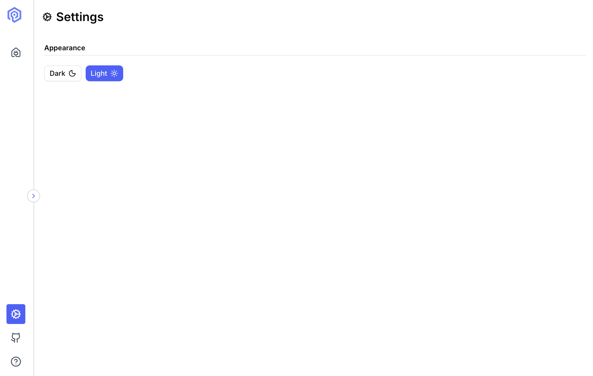

The Settings panel lets you customize Valkey Admin's appearance.

## Appearance

Switch between light and dark themes to match your preference or environment.

| Option | Description |
|--------|-------------|
| **Dark** | Dark background, reduced eye strain in low-light environments |
| **Light** | Light background, better visibility in bright environments |

Changes take effect immediately without restarting the application.

